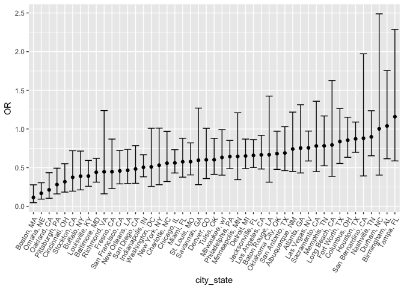
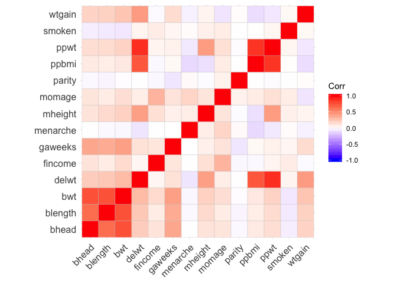
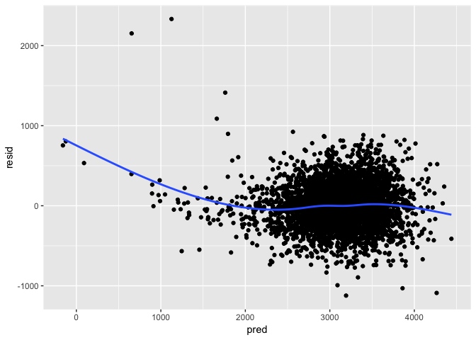
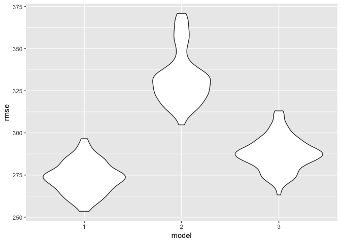

P8105\_hw6\_lz2586
================
Lyuou Zhang
11/25/2018

## problem 1

### data cleaning and create variables

``` r
homicide <- read_csv('./data/homicide-data.csv') %>% 
  janitor::clean_names() %>% 
  mutate(
    city_state = str_c(city, state, sep = ', ')
  ) %>% 
  filter(city_state != 'Dallas, TX' & city_state != 'Phoenix, AZ' & city_state != 'Kansas City, MO' & city_state != 'Tulsa, AL') %>% 
  mutate(
    victim_age = as.numeric(victim_age),
    resolved = as.numeric(disposition == "Closed by arrest"),
    victim_race = ifelse(victim_race == 'White', 'white', 'non-white'),
    victim_race = as.factor(victim_race),
    victim_race = relevel(victim_race, ref = 'white'),
    victim_sex = fct_relevel(victim_sex, ref = 'Male')
  )
```

    ## Parsed with column specification:
    ## cols(
    ##   uid = col_character(),
    ##   reported_date = col_integer(),
    ##   victim_last = col_character(),
    ##   victim_first = col_character(),
    ##   victim_race = col_character(),
    ##   victim_age = col_character(),
    ##   victim_sex = col_character(),
    ##   city = col_character(),
    ##   state = col_character(),
    ##   lat = col_double(),
    ##   lon = col_double(),
    ##   disposition = col_character()
    ## )

    ## Warning in evalq(as.numeric(victim_age), <environment>): NAs introduced by
    ## coercion

  - Created new variables:
      - `city_state`: combines city and state  
      - `resolved`: 1 = resolved (‘Closed by arrest’), 0 = unresolved  
      - `race_cate`: race categorized as `white` and `non-white`, using
        `white` as the reference
  - Filtered cities with no race data

Note that after certain cities were filtered out, there are still
“unknown” entries in `victim_sex` and `victim_race`.

  - `victim_race`: included “unknown” in the `non-white` category.  
  - `victim_sex`: I have three options to deal with missing data:
      - filter them before the analysis  
      - randomly assign them `Male` or `Female`  
      - because we only need the coefficient of non-white compared to
        white, I can just leave it alone for now

<!-- end list -->

``` r
homicide %>% 
  filter(victim_sex == 'Unknown')
```

    ## # A tibble: 560 x 14
    ##    uid      reported_date victim_last  victim_first victim_race victim_age
    ##    <chr>            <int> <chr>        <chr>        <fct>            <dbl>
    ##  1 Alb-000…      20120428 VALERIO      MAY          non-white           NA
    ##  2 Alb-000…      20160205 PURVIS       GEORGE JR.   non-white           NA
    ##  3 Alb-000…      20150211 FOSKEY       PARKER       non-white           NA
    ##  4 Alb-000…      20150301 ESTRADA-GAL… CARLA        non-white           NA
    ##  5 Alb-000…      20150506 GIVENS       COREY        non-white           31
    ##  6 Alb-000…      20150524 RAMOS-CARAV… GERARDO      non-white           NA
    ##  7 Alb-000…      20150524 RASCHICK     KEVIN        non-white           NA
    ##  8 Alb-000…      20150530 PHILLIPS     FELIX        non-white           NA
    ##  9 Alb-000…      20150820 MCGUIRE      ROBERT       non-white           NA
    ## 10 Alb-000…      20160601 BOYER        TIFFANY      non-white           NA
    ## # ... with 550 more rows, and 8 more variables: victim_sex <fct>,
    ## #   city <chr>, state <chr>, lat <dbl>, lon <dbl>, disposition <chr>,
    ## #   city_state <chr>, resolved <dbl>

There are 560 rows whose victim\_sex are missing. The dataset has 48507
rows in total, so there are not a lot of missing data points. I’ll leave
it alone for now, which means I’ll be using “Unknown” as a gender
category in the regression.

### Logistic model for Baltimore

Filter `homicide` to get the data frame for Baltimore, MD

``` r
baltimore <- homicide %>% 
  filter(city == 'Baltimore')
```

logistic model building for Baltimore: using resolved vs. unresolved as
the outcome and victim age, sex and race as predictors.

``` r
logistic_baltimore <- baltimore %>% 
  glm(resolved ~ victim_age + victim_sex + victim_race, data = .,, family = binomial())
```

The output of glm has been saved in `logistic_baltimore`.

``` r
# tidy the results for the logistic regression model for Baltimore
baltimore_results <- logistic_baltimore %>% 
  broom::tidy() %>% 
  mutate(OR = exp(estimate),
         conf_low = estimate - 1.96 * std.error,
         conf_high = estimate + 1.96 * std.error,
         OR_low = exp(conf_low),
         OR_high = exp(conf_high))

# knit into a table
baltimore_results %>% 
  select(term, log_OR = estimate, OR, OR_low, OR_high) %>% 
  knitr::kable()
```

| term                  |     log\_OR |        OR |   OR\_low |  OR\_high |
| :-------------------- | ----------: | --------: | --------: | --------: |
| (Intercept)           |   0.2982436 | 1.3474900 | 0.8908208 | 2.0382654 |
| victim\_age           | \-0.0069900 | 0.9930344 | 0.9867043 | 0.9994050 |
| victim\_sexFemale     |   0.8877869 | 2.4297463 | 1.8610012 | 3.1723071 |
| victim\_racenon-white | \-0.8195997 | 0.4406080 | 0.3129079 | 0.6204234 |

The confidence intervals are computed using `mean + SE*1.96` or `mean -
SE*1.96`. For Baltimore, the OR for non-white victim vs. white victim is
0.441. The confidence interval of the adjusted OR is (0.313, 0.620).

### Logistic regression for all the cities

I’m going to write a function that wraps up model building, tidying
results and computing OR and confidence intervals.

``` r
logistic_function <- function(df){
  
  model = glm(resolved ~ victim_age + victim_race + victim_sex, data = df, family = binomial())
  
  tidy_results = model %>% broom::tidy() %>% 
    filter(term == 'victim_racenon-white') %>% 
    mutate(
      OR = exp(estimate),
        conf_low = estimate - 1.96 * std.error,
        conf_high = estimate + 1.96 * std.error,
        OR_low = exp(conf_low),
        OR_high = exp(conf_high)
    ) 
  
  tidy_results
}
```

I’ll be using list columns with `nest()` because here `purrr::map`
should work with “sub” datasets of each city\_state.

``` r
homicide_nest <- homicide %>% 
  select(city_state, resolved, victim_age, victim_sex, victim_race) %>% 
  group_by(city_state) %>%
  nest()
```

Using `map` to apply the function `logistic_function` to each
city\_state

``` r
# applying function using map
homicide_model_results <- homicide_nest %>% 
  mutate(
    logistic_results = map(homicide_nest$data, logistic_function)
  ) %>% 
  select(-data) %>% 
  unnest()
```

Creating a plot that shows the estimated ORs and CIs for each city:

``` r
homicide_model_results %>%
  mutate(city_state = fct_reorder(city_state, OR)) %>% 
  ggplot(aes(x = city_state, y = OR)) + geom_point() +
  geom_errorbar(aes(ymin = OR_low, ymax = OR_high)) +
  theme(axis.text.x = element_text(angle = 60, hjust = 1))
```

<!-- -->

This figure shows that the city with the smallest estimated OR is
Boston, MA, and the largest OR is in Tampa, FL. There are only two
cities whose ORs are larger than 1: Durham, NC and Tampa, FL, which
means holding other variables constant, we will see increase in the odds
of the victim being non-white vs. the victim being white. However, for
most cities, being white will increase the odds of resolving the case.

## Problem 2

Data import, cleaning and checking missing variables

``` r
# data import and cleaning
birthwt <- read_csv('./data/birthweight.csv') %>% 
  mutate(
    babysex = as.factor(babysex),
    frace = as.factor(frace),
    malform = as.factor(malform),
    mrace = as.factor(mrace)
  )
```

    ## Parsed with column specification:
    ## cols(
    ##   .default = col_integer(),
    ##   gaweeks = col_double(),
    ##   ppbmi = col_double(),
    ##   smoken = col_double()
    ## )

    ## See spec(...) for full column specifications.

``` r
# checking missing variable
skimr::skim(birthwt)
```

    ## Skim summary statistics
    ##  n obs: 4342 
    ##  n variables: 20 
    ## 
    ## ── Variable type:factor ─────────────────────────────────────────────────────────────────────
    ##  variable missing complete    n n_unique                      top_counts
    ##   babysex       0     4342 4342        2         1: 2230, 2: 2112, NA: 0
    ##     frace       0     4342 4342        5 1: 2123, 2: 1911, 4: 248, 3: 46
    ##   malform       0     4342 4342        2           0: 4327, 1: 15, NA: 0
    ##     mrace       0     4342 4342        4 1: 2147, 2: 1909, 4: 243, 3: 43
    ##  ordered
    ##    FALSE
    ##    FALSE
    ##    FALSE
    ##    FALSE
    ## 
    ## ── Variable type:integer ────────────────────────────────────────────────────────────────────
    ##  variable missing complete    n      mean     sd  p0  p25    p50  p75 p100
    ##     bhead       0     4342 4342   33.65     1.62  21   33   34     35   41
    ##   blength       0     4342 4342   49.75     2.72  20   48   50     51   63
    ##       bwt       0     4342 4342 3114.4    512.15 595 2807 3132.5 3459 4791
    ##     delwt       0     4342 4342  145.57    22.21  86  131  143    157  334
    ##   fincome       0     4342 4342   44.11    25.98   0   25   35     65   96
    ##  menarche       0     4342 4342   12.51     1.48   0   12   12     13   19
    ##   mheight       0     4342 4342   63.49     2.66  48   62   63     65   77
    ##    momage       0     4342 4342   20.3      3.88  12   18   20     22   44
    ##    parity       0     4342 4342    0.0023   0.1    0    0    0      0    6
    ##   pnumlbw       0     4342 4342    0        0      0    0    0      0    0
    ##   pnumsga       0     4342 4342    0        0      0    0    0      0    0
    ##      ppwt       0     4342 4342  123.49    20.16  70  110  120    134  287
    ##    wtgain       0     4342 4342   22.08    10.94 -46   15   22     28   89
    ##      hist
    ##  ▁▁▁▁▅▇▁▁
    ##  ▁▁▁▁▁▇▁▁
    ##  ▁▁▁▃▇▇▂▁
    ##  ▁▇▅▁▁▁▁▁
    ##  ▁▂▇▂▂▂▁▃
    ##  ▁▁▁▁▂▇▁▁
    ##  ▁▁▁▅▇▂▁▁
    ##  ▂▇▅▂▁▁▁▁
    ##  ▇▁▁▁▁▁▁▁
    ##  ▁▁▁▇▁▁▁▁
    ##  ▁▁▁▇▁▁▁▁
    ##  ▁▇▆▁▁▁▁▁
    ##  ▁▁▁▇▇▁▁▁
    ## 
    ## ── Variable type:numeric ────────────────────────────────────────────────────────────────────
    ##  variable missing complete    n  mean   sd    p0   p25   p50   p75 p100
    ##   gaweeks       0     4342 4342 39.43 3.15 17.7  38.3  39.9  41.1  51.3
    ##     ppbmi       0     4342 4342 21.57 3.18 13.07 19.53 21.03 22.91 46.1
    ##    smoken       0     4342 4342  4.15 7.41  0     0     0     5    60  
    ##      hist
    ##  ▁▁▁▁▃▇▁▁
    ##  ▁▇▅▁▁▁▁▁
    ##  ▇▁▁▁▁▁▁▁

``` r
# no missing variable
```

### Model building

Model building: Here are the things that I considered when I picked the
indicators:

  - literature shows that factors in this dataset that can affect birth
    weight include mother’s race, mother’s age, prenatal care, nutrition
    and smoking.

  - Babysex, head circumference, baby’s leangth at birth are related to
    baby’s “size”. It makes sense that they are related to baby’s
    weight.

  - As the baby’s age grows, his or her weight will also grow. So
    gestational age might be related to birth weight too.

  - There is no variable that shows if the mom had access to prenatal
    care or her nutrition status. However, mom’s race could be related
    to if she has access to healthcare, and her financial status which
    could further be related to her nutrition status.

  - For mom’s age, there is evidence showing that the incidence of low
    birthweight is higher for mother under 18 or above 35. The range of
    mom’s age in this dataset is 12, 44. So the relationship between
    mom’s age and birth weight is probably not a linear one. I include
    mom’s age because I want to see what the relationship will look
    like.

  - Smoking is associated with adverse pregnancy outcomes because
    smoking during pregnancy harms both the mother and the baby.
    Prenatal smoking is thought to account for 20~30% of cases of low
    birth weight.

Considering other biological and social factors that might be indicators
or confounders, the variables to be used in the model are: babysex,
bhead, blength, delwt, gaweeks, menarche, momage, mrace, and smoken

To take a look at the correlations between variables, I can also create
a correlation heatmap. However, this only works for numeric variables.

``` r
# subset the data to only contain numeric variables:
# because pnumlbw and pnumsga are all 0, there's no need to include them
birthwt_num <- birthwt %>% 
  select_if(is.numeric) %>% 
  select(-pnumlbw, -pnumsga)

corr_wt <- round(cor(birthwt_num), 3)
ggcorrplot(corr_wt)
```

<!-- -->

`blength` and `bhead` and `gaweeks` are positively correlated with birth
weight. `smoken` is negatively correlated with birth weight.

``` r
# model building
birthlm <- lm(bwt ~ babysex + bhead + blength + delwt + momage + gaweeks + menarche +  mrace + smoken, data = birthwt)

birthlm %>% 
  broom::tidy()
```

    ## # A tibble: 12 x 5
    ##    term         estimate std.error statistic   p.value
    ##    <chr>           <dbl>     <dbl>     <dbl>     <dbl>
    ##  1 (Intercept) -5792.      106.      -54.4   0.       
    ##  2 babysex2       29.3       8.50      3.44  5.82e-  4
    ##  3 bhead         132.        3.46     38.1   5.74e-274
    ##  4 blength        75.8       2.02     37.5   2.86e-266
    ##  5 delwt           2.25      0.198    11.4   1.54e- 29
    ##  6 momage          0.331     1.18      0.280 7.79e-  1
    ##  7 gaweeks        11.9       1.46      8.10  7.16e- 16
    ##  8 menarche       -2.21      2.88     -0.765 4.44e-  1
    ##  9 mrace2       -146.        9.79    -14.9   4.78e- 49
    ## 10 mrace3        -70.8      42.8      -1.65  9.84e-  2
    ## 11 mrace4       -120.       18.9      -6.33  2.62e- 10
    ## 12 smoken         -4.74      0.589    -8.05  1.07e- 15

``` r
birthlm %>% 
  broom::glance()
```

    ## # A tibble: 1 x 11
    ##   r.squared adj.r.squared sigma statistic p.value    df  logLik    AIC
    ## *     <dbl>         <dbl> <dbl>     <dbl>   <dbl> <int>   <dbl>  <dbl>
    ## 1     0.714         0.714  274.      985.       0    12 -30527. 61081.
    ## # ... with 3 more variables: BIC <dbl>, deviance <dbl>, df.residual <int>

From the results:

  - R2 = 0.714, which means about 71% of birth weight are explained by
    this model.

  - `babysex`, `bhead`, `blength`, `delwt`, `gaweeks`, `mrace2` (black),
    `mrace4` (Puerto Rican) and smoken are significantly associated with
    birth weight. Among these variables:
    
      - `babysex` (female vs. male), `bhead`, `blength`, `delwt` and
        `gasweeks` are positively associated with birth weight.  
      - `mrace2` (black), `mrace4` (Puerto Rican) and smoken are
        negatively associated with birth weight.  
      - Asian is the only race that is not associated with birth weight.

The plot of predicted values vs. residuals.

``` r
# add predictions and residuals
birthwt <- modelr::add_residuals(birthwt, birthlm)
birthwt <- modelr::add_predictions(birthwt, birthlm)

# residuals vs. predictions plot
birthwt %>% 
  ggplot(aes(x = pred, y = resid)) + geom_point() +
  geom_smooth(se = FALSE)
```

    ## `geom_smooth()` using method = 'gam' and formula 'y ~ s(x, bs = "cs")'

<!-- -->

Except for a few outliers, the residuals look randomly distributed
across the range of the predicted values and around 0.

Alternative model 1:

``` r
model2 <- lm(bwt ~ blength + gaweeks, data = birthwt)

model2 %>% 
  broom::tidy()
```

    ## # A tibble: 3 x 5
    ##   term        estimate std.error statistic  p.value
    ##   <chr>          <dbl>     <dbl>     <dbl>    <dbl>
    ## 1 (Intercept)  -4348.      98.0      -44.4 0.      
    ## 2 blength        129.       1.99      64.6 0.      
    ## 3 gaweeks         27.0      1.72      15.7 2.36e-54

``` r
model2 %>% 
  broom::glance()
```

    ## # A tibble: 1 x 11
    ##   r.squared adj.r.squared sigma statistic p.value    df  logLik    AIC
    ## *     <dbl>         <dbl> <dbl>     <dbl>   <dbl> <int>   <dbl>  <dbl>
    ## 1     0.577         0.577  333.     2958.       0     3 -31381. 62771.
    ## # ... with 3 more variables: BIC <dbl>, deviance <dbl>, df.residual <int>

In this model, both `blength` and `gaweeks` are significantly and
positively associated with birth weight. R2 = 0.5769 and is smaller than
the R2 in the previous model, which means compared to that model, model2
is not as well specified as in terms of independent variables.

Alternative model
2:

``` r
model3 <- lm(bwt ~ bhead + blength + babysex + bhead * blength + bhead * babysex + blength * babysex + bhead * blength * babysex, data = birthwt)

model3 %>% broom::tidy()
```

    ## # A tibble: 8 x 5
    ##   term                    estimate std.error statistic      p.value
    ##   <chr>                      <dbl>     <dbl>     <dbl>        <dbl>
    ## 1 (Intercept)            -7177.     1265.       -5.67  0.0000000149
    ## 2 bhead                    182.       38.1       4.78  0.00000184  
    ## 3 blength                  102.       26.2       3.90  0.0000992   
    ## 4 babysex2                6375.     1678.        3.80  0.000147    
    ## 5 bhead:blength             -0.554     0.780    -0.710 0.478       
    ## 6 bhead:babysex2          -198.       51.1      -3.88  0.000105    
    ## 7 blength:babysex2        -124.       35.1      -3.52  0.000429    
    ## 8 bhead:blength:babysex2     3.88      1.06      3.67  0.000245

``` r
model3 %>% broom::glance()
```

    ## # A tibble: 1 x 11
    ##   r.squared adj.r.squared sigma statistic p.value    df  logLik    AIC
    ## *     <dbl>         <dbl> <dbl>     <dbl>   <dbl> <int>   <dbl>  <dbl>
    ## 1     0.685         0.684  288.     1346.       0     8 -30742. 61501.
    ## # ... with 3 more variables: BIC <dbl>, deviance <dbl>, df.residual <int>

In this model, bhead, blength and babysex are all significantly and
positively associated with birth weight. For the interactions,
bhead:babysex2 and blength:babysex2 are negatively associated with birth
weight. bhead:blength:babysex2 is positively associated with birth
weight. bhead:blength is the only variable that is not significant.

### Cross validation

``` r
cv_df <- crossv_mc(birthwt, 100) %>% 
  mutate(train = map(train, as_tibble),
         test = map(test, as_tibble))

cv_df <- cv_df %>% 
  mutate(
    model1 = map(train, ~lm(bwt ~ babysex + bhead + blength + delwt + momage + gaweeks + menarche + mrace + smoken, data = birthwt)),
    model2 = map(train, ~lm(bwt ~ blength + gaweeks, data = birthwt)),
    model3 = map(train, ~lm(bwt ~ bhead + blength + babysex + bhead * blength + bhead * babysex + blength * babysex + bhead * blength * babysex, data = birthwt))
  ) %>% 
  mutate(
    rmse1 = map2_dbl(model1, test, ~rmse(model = .x, data = .y)),
    rmse2 = map2_dbl(model2, test, ~rmse(model = .x, data = .y)),
    rmse3 = map2_dbl(model3, test, ~rmse(model = .x, data = .y))
  )

cv_df %>% 
  select(starts_with('rmse')) %>% 
  gather(key = model, value = rmse) %>% 
  mutate(
    model = str_replace(model, 'rmse', ''),
    model = fct_inorder(model)
  ) %>% 
  ggplot(aes(x = model, y = rmse)) + geom_violin()
```

<!-- -->

Overall, model1, which is the model that I proposed, has the least rmse.
Compared to the two other models, my model has more independent
variables that could explain birth weight, so it’s better specified. I
think that is why the rmse is lower for this model.
